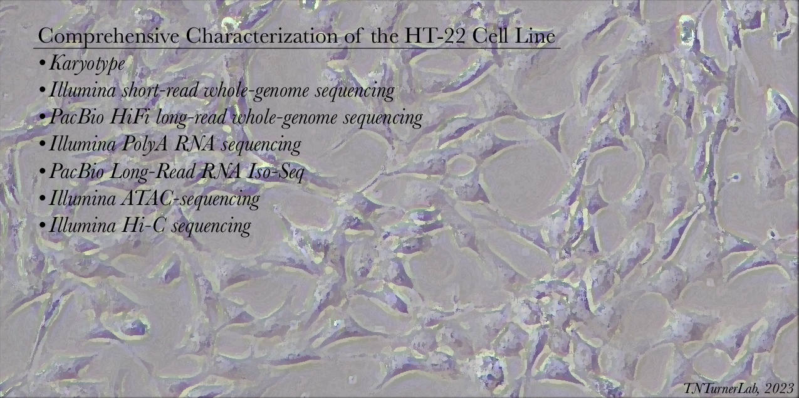

# HT22 Genome, Epigenome, and Functional Genomics Project

## Laboratory of Tychele N. Turner, Ph.D.
## April 2, 2023

## Project contributors:

* Tychele N. Turner, Ph.D.
* Jeffrey K. Ng
* Hillary Heins
* Juana Manuel

## Project Information

In this project, we assess genomic, epigenomic, and functional genomic characteristics of the HT-22 Mouse Hippocampal Neuronal Cell Line.

### Experiments we conducted include: 

* Karyotype
* Illumina short-read whole-genome sequencing
* PacBio HiFi long-read whole-genome sequencing
* Illumina PolyA RNA sequencing
* PacBio Long-Read RNA Iso-Seq
* Illumina ATAC-sequencing of HT-22 cell line
* Illumina Hi-C sequencing of HT-22 cell line

### Raw Data

We have deposited our raw sequencing data in SRA under our NCBI BioProject at https://www.ncbi.nlm.nih.gov/bioproject/?term=PRJNA938057

### Track Hub

We built a custom track hub to load in the UCSC Genome Bowser and it is available at https://data.cyverse.org/dav-anon/iplant/home/tycheleturner/Turner_Lab_Track_Hubs/HT22_genome_epigenome_functional_genomics_project/hub.txt

